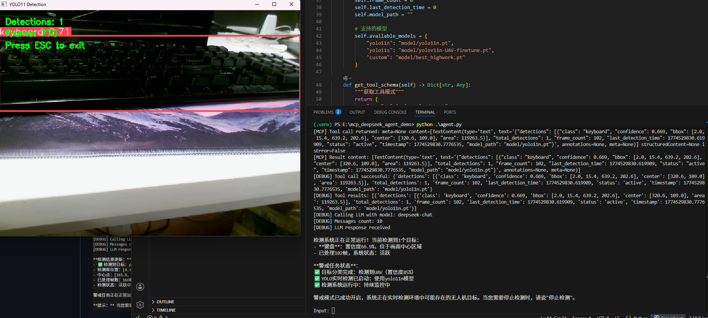

## 🎯 项目运行效果展示

本 UAV 智能体可根据自然语言指令，自动调用 `AeroGuard-Lite` 目标检测技能，完成对无人机画面的实时目标识别与结果反馈。

---

### 1. 智能体指令接收与 detect 技能调用
UAV 智能体在接收到警戒指令后，自动触发远端探测模块并根据结果决策是否开启目标检测技能，随后将识别结果返回并报告系统状态，日志如下：

---

---

### 2. 识别结果反馈
检测完成后，智能体整理并返回结构化识别结果，并报告状态：

### 3.无人机机载摄像头视角
输入指令“报告视野内目标”指令后，得到摄像头识别视角及对物体信息的分析与汇报：

---

## ✨ 功能验证说明
- 成功接收指令并**自动调用 AeroGuard-Lite 目标检测技能**
- 正常读取无人机摄像头实时画面
- 完成目标识别、定位与置信度计算
- 智能体正常输出结构化检测结果反馈
- 智能体根据用户需求动态调整权重与相关超参数，并进行实时的检测状态报告
